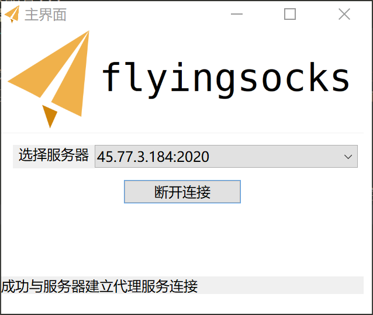

## 介绍
该项目是基于Java Netty开发的Socks5代理客户端/服务器，功能类似于Shadowsocks，个人认为性能比Shadowsocks稍好。<br/>

在客户端与服务端的数据传输上，我们选择了SSL/TLS单向认证的加密方式。服务端需要持有证书和私钥文件（使用CA机构颁发的证书、私钥或者自签证书皆可）。<br>
项目基于Maven构建，分为三个模块：server/client/common模块。<br>

注意该项目客户端与Shadowsocks所采用的通信协议不兼容，需要自己部署该项目的服务端部分到境外服务器上。

## 免责声明
该软件仅供个人学习使用，严禁使用该软件从事任何违法行为，所造成的后果本人不负责任。

## 下载地址
https://github.com/abc123lzf/flyingsocks/tree/v2.0/download <br>
客户端分为四个版本，跟据操作系统选择： <br>
Linux 64位选择flyingsocks-client-v2.0-linux-x64.zip <br>
Windows 32位选择flyingsocks-client-v2.0-windows-x86.zip (64位Windows不能运行) <br>
Windows 64位选择flyingsocks-client-v2.0-windows-x64.zip <br>
Mac OS选择flyingsocks-client-v2.0-windows-mac.zip

此外还提供了Windows版的OpenSSL安装包

## v2.0更新内容
##### 服务端
- 目标服务器构建/转发模块多线程化，根据服务器具体配置调整线程数量，提高服务器吞吐量
- 新增一个端口专门用于接收/验证SSL证书，保证自签证书也能够用于服务器和客户端的SSL通信
- 新增配置文件命令行工具，可通过该工具添加/删除/查看服务器的具体配置
- 优化与客户端的通信协议，减少带宽占用(注意：v2.0客户端与v1.0服务器不兼容)

##### 客户端
- 添加白名单代理模式，可自动识别目标服务器是否是境外服务器
- 优化PAC算法
- 自动缓存SSL证书，无需手动拷贝证书文件
- GUI界面改善，采用SWT框架，适应不同的操作系统环境
- 代码结构优化，BUG修复

## 服务端安装/部署
#### 基本要求
1. 必须安装JRE/JDK 1.8
2. 如果没有SSL证书，需要安装OpenSSL（`yum install openssl`或者`apt-get install openssl`）
3. 至少512MB系统运行内存，推荐1GB运行内存，CPU没什么要求单核也是可以的（针对多核做过优化，如果使用用户多的话需要考虑多核）

#### Linux 操作系统
1. 解压项目文件
2. 在bin目录下，执行`config-file-tool.sh`脚本：
    ````bash
    ./config-file-tools.sh -create
    ````
    按照提示配置好服务器配置，配置文件会构建在`/etc/flyingsocks-server/config.json`文件中，一般来说配置文件格式如下：
        
        [
          {
            "name": "default",
            "port": 2020,
            "cert-port": 7060,
            "max-client": 10,
            "encrypt": "OpenSSL",
            "auth-type": "simple",
            "password": "123456"
          }
        ]
        
    <br>
        config.json格式为JSON数组字符串，每个数组元素可单独绑定一个端口并单独指定加密方式和认证方式。其中，name为节点名称（可任意取名），port为端口，
        max-client为这个节点最大的客户端连接数，encrypt为加密方式，目前仅支持OpenSSL和不加密(正式环境不要用，会影响代理效果)，auth-type为认证方式。<br>
        认证方式目前仅支持simple和user两种方式<br>
        如果选择为simple方式，那么仅需在上述文件中追加password字段即可。<br>
        如果选择为user方式，那么需要追加group字段，group字段的含义是用户组名称，用户组则需要额外的user.json配置文件。<br>
        user.json文件格式如下：<br>
        
        [
          {
            "group": "default",
            "user": [
              {
                "user": "lzf",
                "pass": "abc123"
              }, {
                "user": "4399",
                "pass": "123456"
              }
            ]
          }
        ]	
        
    <br>
        user.json为一个JSON数组字符串，可同时指定多个用户组。<br>
        每个用户组包含两个字段：group字段和user字段。group字段表示该用户组的名称，在config.json配置文件中如果指定了一个节点的认证方
        式为USER方式，那么就需要指定用户组名了。user字段为JSON数组，每个数组元素表示一个用户，每个用户包含用户名及其密码。
        后续版本可能会推出用户管理API、用户流量控制等。目前用户认证和简单认证效果是一样的。

3. 在/var/log目录下建立flyingsocks-server文件夹：<br>
	`mkdir /var/log/flyingsocks-server`<br>
	该文件夹用于记录flyingsocks服务器的日志信息 <br>
	
	如果需要修改日志存储路径，可在bin目录下执行命令行工具`log-tool.sh`：
	````bash
	./log-tool.sh -path ../conf/log4j.properties -folder <your log path> -level INFO
	````
	参数`-path`用来指定`log4j.properties`文件的位置，`-folder`参数为你想修改的日志存储路径，`-level`为日志等级，一般为`INFO`或`WARN`即可。

4. 在conf下建立encrypt文件夹，执行openssl-tool.sh生成SSL证书（如果没有安装OpenSSL请自行安装），在执行过程中会输入一些证书信息。然后将产生的private.key和
   ca.crt拷贝到encrypt目录（不要修改文件名）。

5. 进入项目bin目录：<br>
	`chmod 770 startup.sh` <br>
	`./startup.sh -daemon`<br>
	这样项目就启动了。可以去日志目录下看看最后一行是不是flyingsocks server v1.0 start complete。
	如果启动正常但是客户端无法连接的话看看服务器防火墙有没有开放端口


#### Windows 操作系统
Windows安装方式和Linux大致类似，只不过建立的文件夹路径不同（废话）<br>
首先在C盘的ProgramData目录（一般是隐藏的）下建立文件夹flyingsocks-server，进入该文件夹然后新建log目录。<br>
C:/ProgramData/flyingsocks-server负责存储config.json和user.json配置文件，log目录负责存储日志文件。<br>
设置好后进入bin目录，运行startup.bat


## 客户端安装
#### 基本要求
需要安装JRE/JDK 1.8

#### Linux/Mac 操作系统
1. 在/etc目录下建立flyingsocks-cli文件夹：<br>
	`mkdir /etc/flyingsocks-cli`<br>
2. 在/var/log目录下建立flyingsocks-cli文件夹<br>
	`mkdir /var/log/flyingsocks-cli`<br>
3. 解压客户端项目：<br>
	`unzip flyingsocks-client-1.0.zip`<br>
	`cd flyingsocks-client-1.0.zip`<br>
	修改conf目录下的log4j.properties的`log4j.appender.ROLLING_FILE.File`和`log4j.appender.DAILY_ROLLING_FILE.File`配置项，
	前者改为/var/log/shadowsocks-cli/rolling.log，后者改为/var/log/shadowsocks-cli/daily.log。<br>
4. 进入bin文件夹:
	`chmod 770 startup.sh` <br>
	`./startup.sh -daemon`<br>
	这样客户端就成功启动了，在系统托盘中可以看到小飞机图标，右键该图标即可打开菜单。<br>

	如果不需要GUI界面，可以去/etc/flyingsocks-cli目录下修改config.json文件，将JSON字符串的gui字段改为false，然后手动配置config.json指定需要连接的flyingsocks服务器。

#### Windows 操作系统
1. 在C:/ProgramData下建立shadowsocks-cli文件夹，进入该文件夹后创建log子文件夹。
2. 解压项目文件（任意目录）
3. 运行flyingsocks.exe


## 客户端使用说明
#### 添加代理服务器
1. 右键托盘图标，选择“编辑服务器配置...”
2. 左侧栏点击“点击此处添加服务器配置”,如图：


3. 输入服务器相关配置。基本配置为服务器地址（IP地址或者域名）及其代理端口（默认为2020）。
如果采用OpenSSL加密，则需要指定其证书端口。此外如果认证方式是用户认证，需要输入用户名及其密码，普通认证仅需要输入密码即可。
输入完成后，点击保存即可。在应用程序正常退出时，这些配置会保存在电脑上。


#### 连接到代理服务器
右键托盘图标，选择“打开主界面”，选择刚才配置好的界面，点击连接即可。下方状态栏如果显示“成功与代理服务器建立连接”则代表连接建立成功。


#### 代理模式
flyingsocks提供了四种代理模式，可通过右键托盘图标，在“代理模式”子菜单中选择。各个代理模式作用如下：
1. “不代理”，即所有代理连接都是直连，该模式无需连接到代理服务器。
2. “GFWList模式”，即所有在GFWList名单中的域名（不包含IP地址）都通过代理服务器建立连接，不在名单中的由本地直连。可在用户配置目录下的pac.txt中指定，默认已经包含5000余条记录。
域名的DNS解析都由代理服务器管理，不存在DNS污染问题。
3. “仅代理境外地址”，即所有境外服务器都通过代理服务器建立连接。DNS解析在本地完成，所以可能会存在DNS污染问题。
4. “全局模式”，所有代理请求都由代理服务器完成，包括国内网站，不存在DNS污染问题。

#### 电脑全局代理
如果需要将所有代理连接转发到客户端，需要自行安装Proxifier，安装教程自行百度。建议只代理TCP，UDP还有些问题预计下一个版本完美支持UDP。

## 使用的框架
- Netty 4.1.36 Final
- slf4j 1.7.26 / Apache log4j
- Alibaba FastJSON 1.2.57
- Eclipse SWT 4.2

## 最后
如果在使用过程中有任何BUG可以在ISSUE中提出，或是提供修复的Pull Request，谢谢大家的支持
