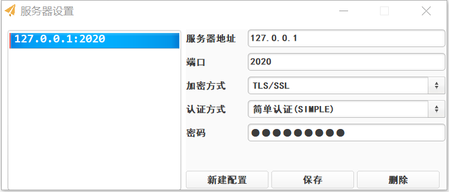

## 介绍
该项目是基于Java Netty框架开发的Socks5代理客户端/服务器，功能类似于Shadowsocks。 
在客户端与服务端的数据传输上，我们选择了SSL/TLS单向认证的加密方式。服务端需要持有CA证书、签名请求以及PKCS8格式的密钥，客户端则需要持有服务端的CA证书。 
项目基于Maven构建，分为两个模块：server模块和client模块。 

## 服务端安装/部署
#### 基本要求
1. 必须安装JRE/JDK 1.8
2. 如果没有SSL证书，需要安装OpenSSL

#### Linux 操作系统
1. 在/etc目录下建立flyingsocks-server文件夹，并进入文件夹： 

	`mkdir /etc/flyingsocks-server` 
	`cd /etc/flyingsocks-server` 
		
		
进入文件夹，新建config.json文件，并按照下列格式配置：  
	
	[
	  {
	    "name": "default",
	    "port": 2020,
	    "max-client": 10,
	    "encrypt": "OpenSSL",
	    "auth-type": "simple",
	    "password": "abc123lzf"
	  }
	]
	
 
	config.json格式为JSON数组字符串，每个数组元素可单独绑定一个端口并单独指定加密方式和认证方式。其中，name为节点名称（可任意取名），port为端口，max-client为这个节点最大的客户端连接数，encrypt为加密方式（目前仅支持OpenSSL和不加密(生产环境不要用)），auth-type为认证方式。 
	认证方式目前仅支持simple和user两种方式 
	如果选择为simple方式，那么仅需在上述文件中追加password字段即可。 
	如果选择为user方式，那么需要追加group字段，group字段的含义是用户组名称，用户组则需要额外的user.json配置文件。 
	user.json文件格式如下： 
	
	[
	  {
	    "group": "default",
	    "user": [
	      {
	        "user": "lzf",
	        "pass": "abc123"
	      }, {
	        "user": "4399",
	        "pass": "123456"
	      }
	    ]
	  }
	]	
	
 
	user.json为一个JSON数组字符串，可同时指定多个用户组。 
	每个用户组包含两个字段：group字段和user字段。group字段表示该用户组的名称，在config.json配置文件中如果指定了一个节点的认证方式为USER方式，那么就需要指定用户组名了。user字段为JSON数组，每个数组元素表示一个用户，每个用户包含用户名及其密码。

2. 在/var/log目录下建立flyingsocks-server文件夹： 
	`mkdir /var/log/flyingsocks-server` 
	该文件夹用于记录flyingsocks服务器的日志信息

3. 解压项目文件： 
	`unzip flyingsocks-server-1.0.zip` 
	`cd flyingsocks-server-1.0` 
	进入conf目录，修改log4j.properties文件的`log4j.appender.ROLLING_FILE.File`和`log4j.appender.DAILY_ROLLING_FILE.File`配置项，将前者改为/var/log/flyingsocks-server/rolling.log，后者改为/var/log/flyingsocks-server/daily.log。
	
	在conf下建立encrypt文件夹，执行openssl-tool.sh生成SSL证书（如果没有安装OpenSSL请自行安装），在执行过程中会输入一些证书信息。然后将产生的ca.crt、client.csr还有pkcs8_server.key拷贝到encrypt目录（不要修改文件名）。

4. 进入项目bin目录： 
	`chmod 770 startup.sh`  
	`./startup.sh -daemon` 
	这样项目就启动了。可以去日志目录下看看最后一行是不是flyingsocks server v1.0 start complete。
	如果启动正常但是客户端无法连接的话看看防火墙有没有设置好

#### Windows 操作系统
Windows安装方式和Linux大致类似，只不过建立的文件夹路径不同（废话） 
首先在C盘的ProgramData目录（一般是隐藏的）下建立文件夹flyingsocks-server，进入该文件夹然后新建log目录。 
C:/ProgramData/flyingsocks-server负责存储config.json和user.json配置文件，log目录负责存储日志文件。 
设置好后按照Linux的方式配置好运行startup.bat就行了。 

## 客户端安装/部署
#### 基本要求
需要安装JRE/JDK 1.8

#### Linux 操作系统
1. 在/etc目录下建立flyingsocks-cli文件夹： 
	`mkdir /etc/flyingsocks-cli` 
2. 在/var/log目录下建立flyingsocks-cli文件夹 
	`mkdir /var/log/flyingsocks-cli` 
3. 解压客户端项目： 
	`unzip flyingsocks-client-1.0.zip` 
	`cd flyingsocks-client-1.0.zip` 
	在conf下建立encrypt文件夹，进入文件夹后创建一个文件夹名和flyingsocks服务器IP/域名一样的文件夹，将刚才部署服务器时创建的证书文件ca.crt复制到这里。 
	随后，修改conf目录下的log4j.properties的`log4j.appender.ROLLING_FILE.File`和`log4j.appender.DAILY_ROLLING_FILE.File`配置项，前者改为/var/log/shadowsocks-cli/rolling.log，后者改为/var/log/shadowsocks-cli/daily.log。 
4. 进入bin文件夹:
	`chmod 770 startup.sh`  
	`./startup.sh -daemon` 
	这样客户端就成功启动了，在系统托盘中可以看到类似于Shadowsocks的小飞机图标，右键选择配置服务器即可进入服务器配置页面： 
	
	  
	
图 客户端GUI界面

	
	点击新建配置，选中左边列表出现的New config项，然后再右边填写服务器信息即可，填写完成后点击保存。
	接着，右键托盘图标，将鼠标停留在“选择服务器”，选中刚才填写的服务器即可。

	如果不需要GUI界面，可以去/etc/flyingsocks-cli目录下修改config.json文件，将JSON字符串的gui字段改为false，然后手动配置config.json指定需要连接的flyingsocks服务器。

#### Windows 操作系统
1. 在C:/ProgramData下建立shadowsocks-cli文件夹，进入该文件夹后创建log子文件夹。
2. 解压项目文件（任意目录）
3. 进入conf文件夹，新建encrypt文件夹，步骤同上，复制证书文件即可。
4. 进入bin目录，双击运行startup.bat启动项目。

## 使用的框架
1. Netty 4.1.36 Final
2. BeautyEye
3. slf4j 1.7.26 / Apache log4j
4. Alibaba FastJSON 1.2.57

## 最后
本人大二学生一枚，做个项目纯粹是兴趣爱好，项目可能有或多或少的BUG，欢迎在ISSUE中指出，后期也可能会更新一些新的功能或是做一些优化。如果你觉得我的项目对你有帮助，欢迎你请我喝一杯咖啡：）

