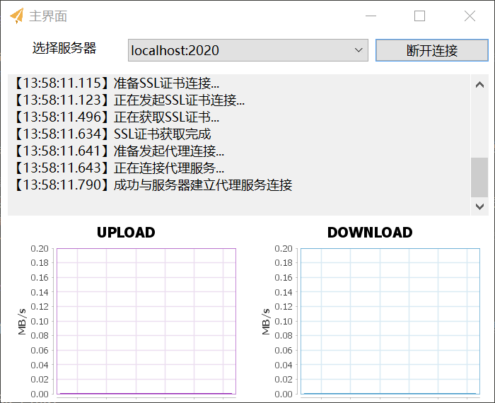

## 介绍

该项目是基于Java Netty开发的Socks5代理客户端/服务器，功能类似于Shadowsocks<br/>

在客户端与服务端的数据传输上，使用TLS 1.2加密。服务端需要持有证书和私钥文件（使用CA机构颁发的证书、私钥或者自签证书皆可）。<br>
项目基于Maven构建，分为三个模块：server/client/common模块。<br>

注意该项目客户端与Shadowsocks所采用的通信协议不兼容，需要自己部署该项目的服务端到境外服务器上。


## 服务端安装/部署

#### 软件依赖
- JDK 1.8
- Maven
- Git
- ZIP压缩、解压工具
- OpenSSL


#### 编译安装
1. 使用Git克隆代码仓库到本地 <br>
2. 使用Maven编译服务端模块 <br>
```
mvn clean install -pl server -am -Dmaven.test.skip=true
```
3. 进入server目录，执行以下命令 <br>
```
mvn assembly:single
```
4. 再进入target目录，解压flyingsocks-server-bin.zip到/opt目录下
```
unzip flyingsocks-server-bin.zip -d /opt
```
5. 进入/opt/flyingsocks-server/config目录，修改配置文件server.json，配置文件格式如下：

        [
          {
            "name": "default",
            "port": 2020,
            "cert-port": 7060,
            "max-client": 10,
            "encrypt": "OpenSSL",
            "auth-type": "simple",
            "password": "123456"
          }
        ]

    <br>
        server.json格式为JSON数组字符串，每个数组元素可单独绑定一个端口并单独指定加密方式和认证方式。其中，name为节点名称（可任意取名），port为代理服务端口，cert-port为用来获取CA证书的端口。
        max-client为这个节点最大的客户端连接数，encrypt为加密方式，目前仅支持OpenSSL和不加密(正式环境不要用，会影响代理效果)，auth-type为认证方式。<br>
        认证方式目前仅支持simple和user两种方式<br>
        如果选择为simple方式，那么仅需在上述文件中追加password字段即可。<br>
        如果选择为user方式，那么需要追加group字段，group字段的含义是用户组名称，用户组则需要额外的user.json配置文件。<br>
        user.json文件格式如下：<br>

        [
          {
            "group": "default",
            "user": [
              {
                "user": "lzf",
                "pass": "abc123"
              }, {
                "user": "4399",
                "pass": "123456"
              }
            ]
          }
        ]	

    <br>
        user.json为一个JSON数组字符串，可同时指定多个用户组。<br>
        每个用户组包含两个字段：group字段和user字段。group字段表示该用户组的名称，在config.json配置文件中如果指定了一个节点的认证方
        式为USER方式，那么就需要指定用户组名了。user字段为JSON数组，每个数组元素表示一个用户，每个用户包含用户名及其密码。
        后续版本可能会推出用户管理API、用户流量控制等。目前用户认证和简单认证效果是一样的。
6. 进入config目录下的encrypt目录，新建文件夹，文件夹名为server.json配置文件中的name属性，进入到该文件夹中，复制CA证书和私钥到该目录，私钥文件名为private.key，需要使用PKCS8编码，公钥文件（证书文件）名为ca.crt。
7. 进入bin目录，执行startup.sh，并使用netstat -tunlp查看端口绑定情况，如果服务没有启动成功，执行startup.sh -t查看错误原因。如果需要关闭服务，执行stop.sh即可。

## 客户端安装

#### 基本要求

需要安装JDK 1.8和Maven

#### 编译安装
1. 执行以下命令
```
# Windows 32位JDK
mvn clean install -pl client -am -P win32 -Dmaven.test.skip=true
# Windows 64位JDK
mvn clean install -pl client -am -P win64 -Dmaven.test.skip=true
# MacOS
mvn clean install -pl client -am -P macos -Dmaven.test.skip=true
# Linux 32位JDK
mvn clean install -pl client -am -P linux32 -Dmaven.test.skip=true
# Linux 64位JDK
mvn clean install -pl client -am -P linux64 -Dmaven.test.skip=true
```
2. 进入client/target目录，运行JAR包
```
javaw -jar flyingsocks-client-3.0-SNAPSHOT-jar-with-dependencies.jar
```


## 客户端使用说明

#### 添加代理服务器

1. 右键托盘图标，选择“编辑服务器配置...”
2. 左侧栏点击“点击此处添加服务器配置”,如图：
   

3. 输入服务器相关配置。基本配置为服务器地址（IP地址或者域名）及其代理端口（默认为2020）。
   对于加密方式，如果服务器使用TLSv1.2加密并且证书为自签证书，则需要选择“TLS v1.2”并指定证书端口，用于事先下载证书；如果是CA机构签发的证书，且该证书与服务器地址匹配，那么选择加密方式“TLS v1.2 (CA证书)”，此时无需填写证书端口。
4. 对于认证方式，如果是用户认证，需要输入用户名及其密码，普通认证仅需要输入密码即可。
5. 输入完成后，点击保存即可。只有在右键系统托盘图标正常退出时，这些配置才会保存在电脑上。

#### 连接到代理服务器

右键托盘图标，选择“打开主界面”，选择刚才配置好的界面，点击连接即可。下方状态栏如果显示“成功与代理服务器建立连接”则代表连接建立成功。


#### 代理模式

flyingsocks提供了四种代理模式，可通过右键托盘图标，在“代理模式”子菜单中选择。各个代理模式作用如下：

1. “不代理”，即所有代理连接都是直连，该模式无需连接到代理服务器。
2. “GFWList模式”，即所有在GFWList名单中的域名（不包含IP地址）都通过代理服务器建立连接，不在名单中的由本地直连。可在用户配置目录下的pac.txt中指定，默认已经包含5000余条记录。
   域名的DNS解析都由代理服务器管理，不存在DNS污染问题。
3. “仅代理境外地址”，即所有境外服务器都通过代理服务器建立连接。DNS解析在本地完成，所以可能会存在DNS污染问题。
4. “全局模式”，所有代理请求都由代理服务器完成，包括国内网站，不存在DNS污染问题。

#### 透明代理

暂不支持

## 使用的框架

- Netty
- slf4j
- FastJSON
- Eclipse SWT

## 最后

如果在使用过程中有任何BUG可以在ISSUE中提出，或是提供修复的Pull Request
